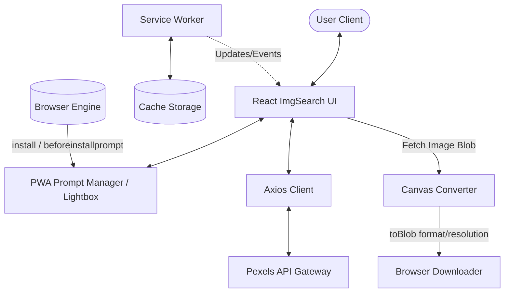
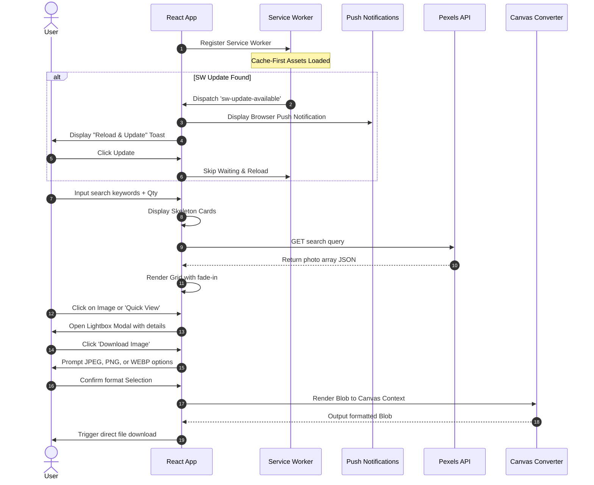

# ImgSearch Pro PWA

[](https://app.netlify.com/sites/googlepexels/deploys)  

[](https://googlepexels.netlify.app/)

ImgSearch Pro is a Progressive Web Application (PWA) built with React 18 and styled with glassmorphism aesthetics. It allows users to search for high-resolution graphics and photographs via the Pexels API, preview them in-app via an immersive lightbox, choose custom file formats (JPEG, PNG, WEBP), crop them to their specific screen size as device wallpapers, and run completely offline when installed.

---

## 🚀 Key Features

* **Progressive Web App (PWA)**: Fully installable directly onto devices (desktop, Android, iOS) with off-line support.
* **Custom Install & Update Banners**: Custom-built, sliding glassmorphic prompts that notify users when updates are available or when the app can be installed.
* **Local Push Notifications**: Full integration with the browser's native `Notification` API to alert users when the app is installed or updated in the background.
* **Image Lightbox (Quick View)**: View high-resolution photos on the app itself using an interactive overlay preview with backdrop blur.
* **Client-Side Format Picker**: Prompt for file formats (**JPEG, PNG, WEBP**) upon download. Image format conversion is performed on-the-fly client-side using the HTML5 Canvas API.
* **Aspect Fill Wallpaper Cropper**: Automatically calculates screen dimensions and crop aspect ratios to fit screen sizes perfectly.
* **Rich Aesthetics**: Premium slate-dark theme featuring subtle gradients, glassmorphism card containers, rounded shapes, and fluid micro-animations.
* **Skeleton Loading States**: Smooth animated skeleton cards that animate during API search actions.

---

## 🛠️ Technology Stack & Versions

| Technology | Badge | Version | Description |
| :--- | :--- | :--- | :--- |
| **React** |  | `v18.3.1` | Core UI library & state management |
| **PWA / Workbox** |  | `v6.6.0` | Caching engines, routes, & service worker |
| **Bootstrap** |  | `v5.3.3` | Responsive layout grid system |
| **React-Bootstrap** |  | `v2.10.2` | Wrapper framework for React 18 |
| **Semantic UI CSS** |  | `v2.5.0` | Icons & glyph decorations |
| **Axios** |  | `v1.7.2` | REST API request client |
| **Pexels SDK** |  | `v1.4.0` | Developer helper SDK |
| **HTML5 / Canvas** |  | `Standard` | Client-side image format processing |

---

## 📐 Architecture Diagram



---

## 🔄 Application Flow



---

## 📂 Project Directory Structure

```text
image-search-download/
├── public/                     # Static assets & PWA files
│   ├── android-chrome-192.png  # PWA app icons (new neon design)
│   ├── favicon.ico             # App Favicon
│   ├── index.html              # HTML shell entrypoint
│   └── manifest.json           # PWA metadata (categories, background, theme colors)
├── scripts/
│   └── fix-semantic-ui.js      # Post-install Semantic UI CSS fix
├── src/                        # React source code
│   ├── assets/
│   │   └── bg.jpg              # Page background image
│   ├── components/
│   │   ├── Footer/
│   │   │   ├── Footer.js       # App footer
│   │   │   └── Footer.css      # Footer styles
│   │   └── PWAPrompt/
│   │       ├── PWAPrompt.js    # PWA install prompt / notification toggles
│   │       └── PWAPrompt.css   # Glassmorphic prompt styles
│   ├── googlePexel.js          # Core application search & canvas converter
│   ├── index.js                # React 18 client entrypoint
│   ├── index.css               # Global glassmorphism theme & variables
│   ├── service-worker.js       # Workbox cache service worker configuration
│   └── serviceWorkerRegistration.js # SW registration handler
├── package.json                # Project configurations & dependency versions
└── README.md                   # Project documentation
```

---

## ⚙️ Installation & Setup

1. **Clone the repository**:
   ```sh
   git clone https://github.com/ajf013/image-search-download.git
   cd image-search-download
   ```

2. **Install dependencies**:
   ```sh
   npm install --legacy-peer-deps
   ```

3. **Start local development server**:
   ```sh
   npm start
   ```
   *The server will start running on [http://localhost:3000](http://localhost:3000)*

4. **Change the Pexels access token (Optional)**:
   Open [googlePexel.js](file:///Users/fcruz/Documents/GitHub/Personal/image-search-download/src/googlePexel.js) and update the `access_token` variable with your credentials if required.

---

## 📬 Contact & Links

Feel free to connect or ask questions!

* **Francis Cruz**: [](https://www.linkedin.com/in/ajf013-francis-cruz/)
* **GitHub Profile**: [](https://github.com/ajf013)
* **Email Contact**: [](mailto:cruzmma2021@gmail.com)
* **Twitter/X**: [](https://x.com/Itsme_Ajf013)
